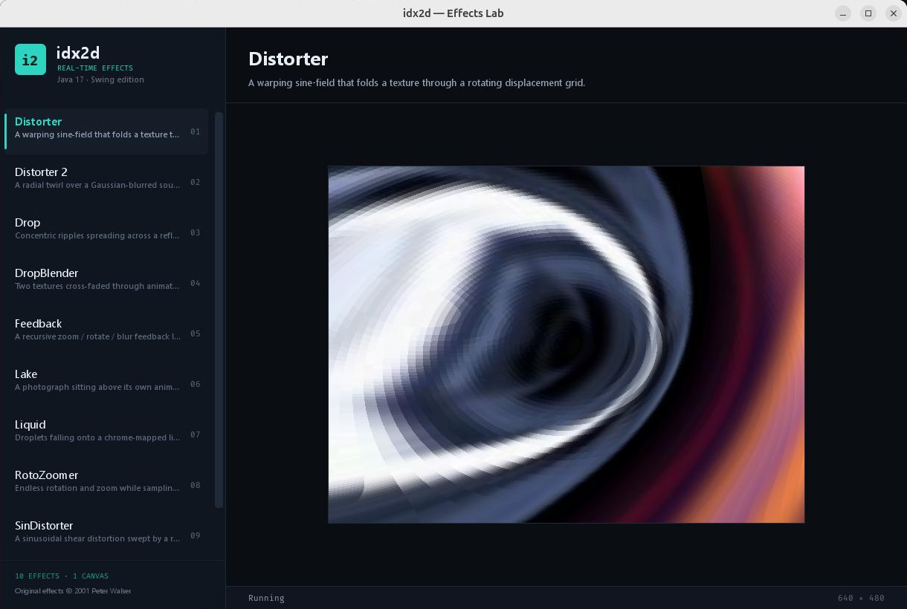

# idx2d — Effects Lab

A modern **Java 17 / Swing** revival of *idx2d*, a real-time software-rendering effects library
originally written in 2001 as a set of Java Applets.

All ten original effects have been ported into a single executable desktop application with a dark,
tech-themed split view: pick a demo on the left, watch it render on the right.



## Overview

- **10 classic effects** — texture distortion, ripples, feedback, rotozoom, tunnels and more.
- **Pure software rendering** — every frame is computed into an `int[]` ARGB buffer, no GPU or external
  dependency.
- **Single executable uber jar** — effects and textures are bundled, so it runs with just a JDK.
- **Modern dark UI** — custom-painted sidebar, hover/selected states, slim scrollbar, typographic
  hierarchy and status bar.
- **Clean lifecycle** — each demo owns a daemon animation thread that starts when selected and stops when
  you switch away (no `Thread.stop()`, no leaked threads).

## Requirements

- JDK 17 or newer (built and tested on JDK 25)
- Apache Maven 3.8+

## Build

```bash
mvn clean package
```

This compiles, runs the tests and produces a self-contained executable jar at `target/idx2d.jar`
(effects + textures included).

## Run

```bash
java -jar target/idx2d.jar
```

## Using the application

- The **left sidebar** lists the demos. **Distorter** is selected on startup.
- Select with the mouse, or navigate with `↑`/`↓` and `←`/`→`.
- The **right pane** shows the demo name, a short description and the running effect.
- The **status bar** shows the current status and the canvas resolution.

Interactive demos:

| Demo | Interaction |
|---|---|
| Liquid | Move the mouse over the canvas, click/drag to drop, press `M` to toggle random droplets |
| Tunnel | Click the canvas for hyperspeed |

## Demos

| # | Demo | Description |
|---|------|-------------|
| 01 | **Distorter** | A warping sine-field that folds a texture through a rotating displacement grid |
| 02 | **Distorter 2** | A radial twirl over a Gaussian-blurred source, with an oscillating focal point |
| 03 | **Drop** | Concentric ripples spreading across a reflective surface |
| 04 | **DropBlender** | Two textures cross-faded through animated water ripples |
| 05 | **Feedback** | A recursive zoom / rotate / blur feedback loop that never settles |
| 06 | **Lake** | A photograph sitting above its own animated water reflection |
| 07 | **Liquid** | Droplets falling onto a chrome-mapped liquid surface |
| 08 | **RotoZoomer** | Endless rotation and zoom while sampling a texture |
| 09 | **SinDistorter** | A sinusoidal shear distortion swept by a rotating field |
| 10 | **Tunnel** | A classic perspective texture tunnel |

## Project structure

```
pom.xml
src/main/java/idx2d/            core pixel buffer, colour maths, grids, distorters, filters, physics
src/main/java/idx2d/tools/      ImageIO-based bitmap helper
src/main/java/idx2d/app/        DemoView, Params, Demo, DemoCatalog, MainFrame, Idx2dApp
src/main/java/idx2d/app/demo/   the ten ported effects
src/main/java/idx2d/app/ui/     dark theme and Swing components
src/main/resources/textures/    textures bundled into the jar
src/test/java/                  JUnit 5 tests
legacy/                         original 2001 Applet sources, HTML pages, jars and unused images
docs/screenshot.png
refactoring-idx2d-modernization.md   migration plan and work log
```

## Architecture notes

- **`Texture`** is a mutable ARGB `int[]` pixel buffer. `getImage()` returns a `BufferedImage` that
  *shares* the same array, so a demo only mutates pixels and repaints — no per-frame copies.
- **`DemoView`** replaces the old `ThreadApplet`: the effect runs on a daemon animation thread, while all
  painting happens on the Swing EDT via `paintComponent`.
- **Textures are classpath resources** loaded with `ImageIO` (`TextureLoader`), replacing applet
  `getDocumentBase()`.
- **No runtime dependencies.** JUnit 5 is test-scope only.

## History

The original sources were Java Applets (`.html` launchers, `idx2d.jar`, AWT event overrides,
`Thread.stop()`). They were reorganised into a standard Maven layout, migrated to Java 17 and ported to
Swing. The original applet sources, HTML pages, jars and unused images are preserved under `legacy/` for
reference. The full plan, decisions and work log live in
[`refactoring-idx2d-modernization.md`](refactoring-idx2d-modernization.md).

## Credits

- Original **idx2d** library, effects and demo applets — © 2001 Peter Walser (`proxima@active.ch`).
- Java 17 / Swing port and application shell.
